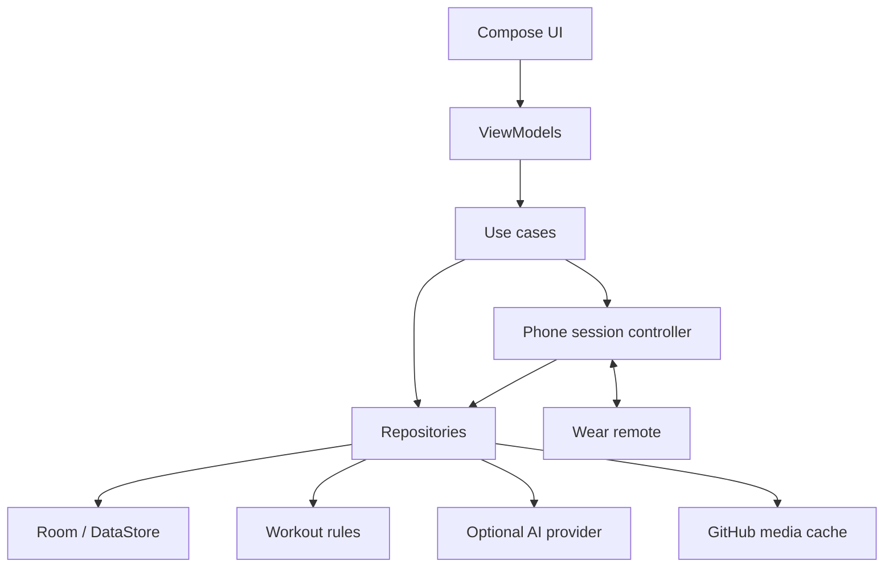
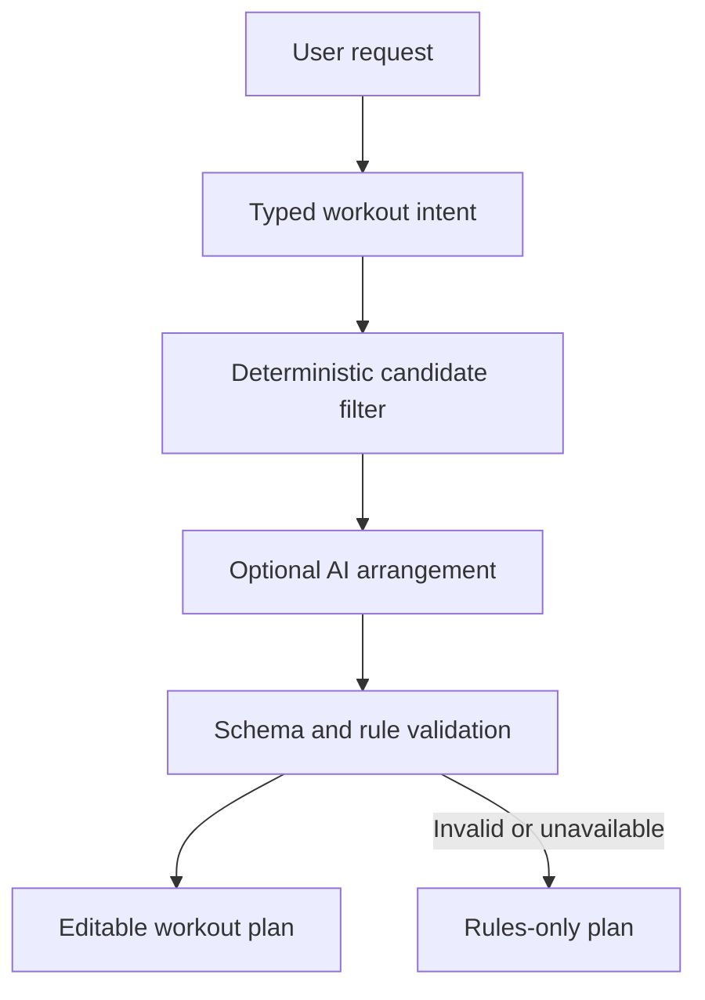
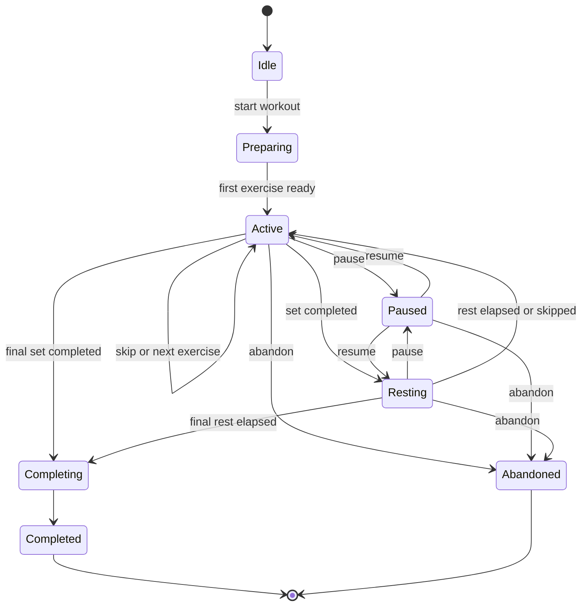

# RepForth — Android & Wear OS Project Guideline

Status: approved technical direction  
Last updated: 2026-08-27

This document is the implementation source of truth for a local-first, open-source exercise app built with native Kotlin and Jetpack Compose for Android phones and Wear OS watches.

## 1. Locked product decisions

| Area | Decision |
|---|---|
| Product name | RepForth |
| Working tagline | “Every rep moves you forward.” |
| Primary platform | Android phone |
| Watch | Wear OS companion written in Kotlin and Compose for Wear OS |
| Watch independence | Connected-phone remote only; the phone is always authoritative |
| Backend | None |
| Accounts and sync | None; all user data remains on the phone |
| AI | Deterministic rules engine plus an optional user-configured cloud model |
| API credentials | Bring your own key (BYOK), entered in Settings |
| Initial AI support | Native Gemini adapter plus a generic OpenAI-compatible adapter |
| Exercise data | `hasaneyldrm/exercises-dataset`, imported and versioned in the app project |
| Dataset/media pin | Commit `7455efae41b330c265e7cd4b78dfa848e7ce5ebd`, recorded once in `dataset-version.toml` |
| Media | Licensed flavors download and cache images/GIFs on demand from the pinned upstream commit; placeholder flavors ship generated art and make no media requests |
| Languages | English and Turkish app UI and exercise instructions |
| Interface | Material 3, polished native motion, dark-first visual system |
| Primary navigation | Today · Plans · Exercises · Progress; Coach is a mode inside the builder, not a tab (§12) |
| Source model | Open source; no proprietary service is required to build or run the core app |

“Local-only” means the app has no developer-operated server, account, telemetry service, or cloud database. Network access is still used when the user explicitly asks the app to call an AI provider, or when a licensed build downloads uncached exercise media. The public `placeholder` flavors (§18) issue no media requests at all.

## 2. Product definition

RepForth is a local-first, AI-assisted exercise planner and workout tracker. The phone app lets a user browse exercises, build and perform workouts, track local progress, and optionally ask an AI coach to generate a plan from goals such as:

- “Create a 30-minute chest and triceps workout.”
- “Prioritize back, include a little biceps, and use dumbbells only.”
- “Make a beginner leg workout without calves.”
- “Replace this exercise with something using body weight.”

The model never invents exercises. Normal Kotlin code selects an eligible set from the bundled dataset, the model arranges or explains those candidates, and Kotlin validation rejects any invalid result.

The watch is a focused remote for an active phone workout. It shows the current exercise, target repetitions or duration, set count, rest timer, and next exercise. It sends complete, pause/resume, skip, and next commands to the phone.

## 3. MVP scope

### Phone MVP

- First-run onboarding: goals, experience, available equipment, training days, normal session length, preferred and excluded muscles/movements.
- Search and filter the full bundled catalog (1,324 records at the pinned commit) by name, body part, target muscle, secondary muscle, and equipment.
- Exercise details with English/Turkish instructions, thumbnail, and tap-to-play GIF in licensed flavors; placeholder flavors show generated art plus the full text instructions.
- Manual workout builder.
- Rules-only workout generator that works without an API key or internet access.
- AI-assisted generation from natural language and explicit muscle-group selections.
- Editable generated plan before starting.
- Active workout mode with sets, reps, weights, timed intervals, rest timer, pause, skip, replacement, and notes.
- Local workout history and basic progress summaries.
- AI provider settings, key validation, model selection, and key deletion.
- English and Turkish localization.

### Watch MVP

- Connection/disconnection status.
- Current exercise name and compact static thumbnail.
- Current set/total sets and repetitions or duration.
- Rest countdown with skip-rest action.
- Complete set, pause/resume, skip exercise (abandon its remaining sets and advance), and next exercise (advance after the final set is completed).
- Haptic signal when a timed set or rest reaches zero.
- Ongoing activity entry so the user can return from the watch face.

### Explicit non-goals for MVP

- User accounts, cloud backup, cross-device history sync, social features, or a web app.
- AI calls from the watch or storage of the user’s API key on the watch.
- A fully standalone watch workout engine.
- Heart-rate, GPS, calorie, Health Services, or Health Connect integration.
- Camera-based pose estimation or medical/injury diagnosis.
- Streaming GIFs continuously on the watch.
- Supporting every proprietary AI API separately.

These can be added later without changing the core local architecture.

## 4. Platform baseline

Use current stable tooling at implementation time and keep all versions in `gradle/libs.versions.toml`.

| Setting | Guideline |
|---|---|
| Language | Kotlin only |
| UI | Jetpack Compose + Material 3 |
| Phone `minSdk` | API 28 (Android 9) |
| Wear `minSdk` | API 30 (Wear OS 3 baseline) |
| `compileSdk` / `targetSdk` | Latest stable SDK supported by the current Android Gradle Plugin and required by Google Play |
| Java toolchain | Current Android-supported LTS JDK |
| Async/state | Kotlin coroutines, `Flow`, immutable UI state |
| Build | Gradle Kotlin DSL, version catalog, convention plugins when duplication appears |

Do not hard-pin library versions in this guideline. Use stable releases, enable dependency locking, and update deliberately through reviewed pull requests. Avoid alpha/beta dependencies unless a required Wear OS capability has no stable equivalent and the exception is documented.

## 5. Technical architecture

Follow unidirectional data flow and Android’s recommended layered architecture:



Rules:

- Composables render state and emit user actions; they do not access Room, DataStore, the network, or Wear APIs directly.
- ViewModels expose a single immutable `UiState` per screen and accept typed events.
- Repositories are the only entry points to data sources.
- Domain rules are pure Kotlin wherever possible so they are fast and easy to test.
- The phone’s active-session controller is the sole authority for workout state.
- Every AI and watch result is treated as untrusted input and validated before it changes state.

### Suggested project modules

```text
repforth/
├── app/                         # Android phone application
├── wear/                        # Wear OS companion application
├── core/
│   ├── model/                   # Shared immutable domain models
│   ├── common/                  # Dispatchers, Result/error types, utilities
│   ├── database/                # Room entities, DAOs, migrations
│   ├── datastore/               # Non-secret preferences
│   ├── designsystem/            # Phone theme, tokens, reusable components
│   ├── designsystem-wear/       # Wear theme and components; Wear M3 is a separate library
│   ├── wear-protocol/           # Phone/watch state and command DTOs
│   ├── exercise-data/           # Dataset importer and exercise repository
│   ├── media/                   # URL manifest, Coil configuration, cache policy
│   ├── rules/                   # Candidate selection and rules-only generation
│   └── ai/                      # Provider interfaces, clients, validation
├── feature/
│   ├── onboarding/
│   ├── today/
│   ├── plans/                    # Saved plan library
│   ├── exercises/                # Catalog search, filters, detail
│   ├── coach/                    # AI request + refinement; surfaced inside the builder
│   ├── workout-builder/
│   ├── active-workout/
│   ├── progress/
│   └── settings/
├── benchmark/                   # Baseline profile and macrobenchmark tests
├── build-logic/                 # Convention plugins when justified
└── docs/
```

Start with these boundaries, but do not create empty modules purely for symmetry. A small feature may remain a package until it becomes independently testable or reusable.

### Main libraries

- Compose BOM, Material 3, Navigation Compose, Lifecycle/ViewModel Compose.
- Compose for Wear OS Material 3 and Wear navigation components.
- Room for structured local data.
- Preferences DataStore for non-secret settings.
- Hilt for dependency injection.
- Kotlin serialization for persisted/imported JSON and network DTOs.
- OkHttp for dynamic AI provider URLs and media networking.
- Coil 3 with GIF support for thumbnails and animations, using one shared phone `ImageLoader`.
- Google Play services Wearable Data Layer for phone/watch communication.
- WorkManager only for deferrable cache maintenance or explicitly requested prefetch; not for active workout timers.
- Android Keystore plus Tink for encrypting API-key material.

## 6. Exercise dataset integration

Upstream: <https://github.com/hasaneyldrm/exercises-dataset>  
Pinned commit: `7455efae41b330c265e7cd4b78dfa848e7ce5ebd`

The upstream repository currently documents 1,324 records with exercise IDs, body part/category, equipment, target, muscle group, secondary muscles, English/Turkish instructions, thumbnails, and 180×180 GIFs. Treat its stable exercise ID as the external identifier.

### Import policy

Do not load and parse the full JSON on every app start.

1. `dataset-version.toml` is the single source of truth for the pinned commit. Every import path and media URL is derived from it; no other file hard-codes the SHA. Updating it requires a dedicated reviewed pull request.
2. Run a build-time import task or checked-in import script.
3. Validate input against `exercises.schema.json`.
4. Normalize whitespace and categorical values, but never silently change upstream IDs.
5. Keep only English and Turkish instruction fields in the initial app artifact.
6. Generate a prepackaged Room database or a compact import artifact.
7. Generate `media-manifest.json` containing each exercise ID, thumbnail URL, GIF URL, expected SHA-256, byte size, media version, and attribution.
8. Fail CI on duplicate IDs, missing translations, bad paths, missing hashes, or schema drift.

Do not point production builds to the mutable `main` branch. Use an immutable tag or commit in every media URL.

### Core exercise model

```kotlin
data class Exercise(
    val id: ExerciseId,
    val name: String,
    val bodyPart: BodyPart,
    val target: Muscle,
    val muscleGroup: Muscle,
    val secondaryMuscles: Set<Muscle>,
    val equipment: Equipment,
    val instructions: LocalizedInstructions,
    val thumbnail: MediaRef,
    val animation: MediaRef,
    val attribution: String,
)
```

Use value classes/enums or normalized lookup tables for IDs and categorical values. Preserve the original strings in an import-audit table or generated report so upstream changes can be reviewed.

### Licensing boundary

- Dataset structure, code, and instruction text are MIT-licensed according to the upstream project.
- Images and GIFs are a separate Gym visual copyright exception.
- Keep media attribution intact in the manifest and exercise detail UI.
- Do not include or download protected media in public release builds until the required reuse permission is obtained.
- Support a `placeholderMedia` build flavor so the open-source project remains buildable without licensed assets.

## 7. Local persistence

Room is the source of truth for structured app data. DataStore holds lightweight non-secret preferences. API credentials are encrypted separately and must never be stored in Room or ordinary DataStore.

### Recommended Room tables

| Table | Purpose |
|---|---|
| `exercise` | Imported normalized exercise metadata |
| `exercise_instruction` | English/Turkish instructions and ordered steps |
| `workout_template` | Saved manual or generated plans |
| `template_exercise` | Ordered exercises, targets, sets, reps/duration, rest |
| `workout_session` | Start/end/pause state and summary |
| `session_exercise` | Per-session ordered exercise state |
| `set_record` | Completed/skipped set, reps, weight, duration, RPE |
| `user_profile` | Goals, level, equipment, schedule, preferences |
| `movement_exclusion` | Avoided exercise IDs, muscles, or movements |
| `coach_conversation` | Optional local-only coach messages; user can disable/clear |
| `generation_audit` | Constraints, provider/model, selected IDs, validation outcome; never API keys |

Every mutable table uses a UUID primary key, `createdAt`, and `updatedAt`. Dataset exercises retain their upstream string IDs. Store weights internally in kilograms and convert only for display. Store durations in milliseconds and timestamps as UTC instants.

Write explicit Room migrations from the first public release onward. Never use destructive migration in release builds.

### Data export and deletion

Because there is no account or backend, users need control over the only copy of their data:

- Export all user-created data as a versioned JSON file.
- Import only after schema validation and a preview of what will change.
- “Delete all workout data” must not delete the built-in exercise catalog.
- “Reset app” deletes user data, AI settings, encrypted keys, and cached media after confirmation.
- Android Auto Backup may back up ordinary app files by default; explicitly exclude encrypted key files and decide whether local workout history should participate. Document this accurately in the privacy screen.

## 8. AI architecture

### Backend decision

No backend is needed. The phone calls the provider directly using the key supplied by the user. This makes deployment simpler and preserves the local-first model, but it also means:

- Provider usage, cost, retention, and rate limits belong to the user’s provider account.
- The app cannot hide or subsidize a shared developer API key.
- The app must clearly show what workout/profile text will leave the device.
- Provider availability is optional; every essential workout function needs a non-AI fallback.

### Provider abstraction

```kotlin
interface AiProvider {
    val id: ProviderId
    suspend fun testConnection(config: ProviderConfig): ProviderTestResult
    suspend fun generateWorkout(config: ProviderConfig, request: AiWorkoutRequest): AiWorkoutResponse
    suspend fun coach(config: ProviderConfig, request: CoachRequest): CoachResponse
}
```

Providers are stateless. `ProviderConfig` is resolved per call from encrypted storage, passed in, and never cached in the provider instance or retained beyond the call.

Implement:

1. `GeminiProvider`: native Gemini REST integration and structured JSON output.
2. `OpenAiCompatibleProvider`: configurable HTTPS base URL, API key, model name, and a small allowlist of optional custom headers.
3. `FakeAiProvider`: deterministic fixtures for tests and previews.

“All AI endpoints” is not a realistic single protocol. The generic adapter should support services that implement the relevant OpenAI-compatible request/response shape. Providers with unique protocols, such as Anthropic’s native API, get separate adapters later. Keep provider-specific DTOs internal and map them to shared domain requests.

Do not depend on a vendor SDK in domain code. Direct HTTP clients make dynamic endpoints, local model servers, and consistent cancellation/error handling easier.

### AI Settings UX

- Provider: Gemini or OpenAI-compatible.
- API key: masked, pasteable, never shown again in full.
- Model: sensible default plus editable model ID.
- Base URL: visible only for the generic provider.
- “Test connection” with actionable authentication, model, quota, network, and format errors.
- “Delete key” and “Delete all provider settings.”
- Optional request timeout and advanced custom headers behind an advanced section.
- A disclosure that prompts are sent directly to the selected third party.
- Never send the key or provider configuration to the watch.

Allow only `https://` endpoints by default. A developer setting may permit cleartext `http://` for a loopback/LAN model such as Ollama or LM Studio, with a prominent warning and narrowly scoped Android network-security configuration.

### Secure API-key storage

1. Generate a non-exportable encryption key in Android Keystore.
2. Encrypt the provider secret with Tink authenticated encryption.
3. Store only ciphertext and non-secret provider metadata in internal app storage.
4. Exclude ciphertext metadata and key-related files from backup.
5. Redact authorization headers and prompts from release logs.
6. Clear sensitive text-field state after saving.
7. Never commit keys, put them in `BuildConfig`, include them in sample files, or send them in crash reports.

No client-side storage can make a user-entered secret impossible to extract on a compromised device. The goal is strong platform-appropriate protection, not an impossible guarantee.

### Generation pipeline



1. Build a typed `WorkoutIntent` from explicit UI controls. Natural language may fill missing values, but it never overrides explicit selections.
2. Filter candidates locally by requested primary/secondary muscles, exclusions, equipment, experience, and exercise availability.
3. Apply hard rules before AI: excluded IDs/muscles, unavailable equipment, session-duration ceiling, no duplicate exercise IDs, and minimum candidate diversity.
4. Send only a compact candidate catalog (IDs and needed metadata), workout intent, and local safety constraints to the provider.
5. Require structured output matching a versioned JSON Schema.
6. Validate exercise IDs, types, ranges, duration estimate, volume, order, and exclusions locally.
7. Repair only safe mechanical issues locally; otherwise retry once with validation errors.
8. Fall back to the deterministic generator if the provider is missing, offline, rate-limited, or still invalid.
9. Show the plan as editable cards and require the user to start it explicitly.

### Request contract

```json
{
  "schema_version": 1,
  "locale": "en",
  "goal": "hypertrophy",
  "experience": "beginner",
  "primary_muscles": ["chest"],
  "secondary_muscles": ["triceps"],
  "excluded_muscles": ["calves"],
  "equipment": ["dumbbell", "body_weight"],
  "duration_minutes": 40,
  "candidate_exercises": [
    {"id": "...", "target": "...", "equipment": "..."}
  ]
}
```

All categorical values are the normalized language-neutral tokens produced by the importer (§6, step 4), never raw upstream display strings such as `body weight`. Only `locale` and free-text rationale are language-dependent.

The response contains only dataset exercise IDs, order, sets, repetition range or duration, rest seconds, optional tempo, and short rationale. Define numeric limits in code, not only in the prompt.

### Initial rules engine

Hard rules:

- Never select excluded movements, muscles, or unavailable equipment.
- Every exercise ID must exist in the pinned dataset.
- Respect session length using a deterministic duration estimator.
- Warm-up work precedes primary compound work; isolation work follows compounds.
- Avoid redundant consecutive exercises with the same primary target and movement pattern when alternatives exist.
- Apply beginner-safe set/repetition/rest ranges and conservative volume.
- Timed and repetition-based exercises must use the correct target type.

Soft scoring:

- Primary requested muscle match.
- Secondary requested muscle match.
- Equipment preference.
- Balanced movement patterns.
- User history: avoid repeatedly skipped exercises and rotate equivalents.
- Difficulty feedback/RPE and recent training volume.

The rules engine must be deterministic for a supplied seed. Persist the seed with generated plans so failures are reproducible.

### Coach safety

- Present the app as general fitness planning, not medical advice.
- Do not diagnose pain or injury, prescribe treatment, or claim guaranteed outcomes.
- When the user reports sharp/severe pain, neurological symptoms, or injury, stop exercise-specific progression advice and recommend appropriate professional help.
- Prefer “stop if painful” and form cues over assurances of safety.
- The model cannot directly start, modify, or complete a workout; it proposes typed changes that the app validates and the user confirms.

## 9. Media delivery without a backend

### Chosen strategy

Bundle metadata and lightweight placeholders in the app. Download thumbnails and GIFs when first needed, then keep them in a bounded disk cache. Prefetch only the current and next few exercises in an accepted workout. This download path is reachable only in the licensed flavors (§18); in placeholder flavors the `MediaSource` implementation resolves every `MediaRef` to bundled generated art and performs no network I/O. Both the imported metadata and media must come from the commit pinned in `dataset-version.toml` so their paths cannot drift apart.

GitHub can host this without an application backend:

- Build the immutable base URL from the pinned commit: `https://raw.githubusercontent.com/hasaneyldrm/exercises-dataset/<pinned-commit>/`.
- Construct a thumbnail URL by appending the record's `image` path and a GIF URL by appending its `gif_url` path. Do not commit the upstream media into the app repository.
- A GitHub Release can host a versioned ZIP for an optional “download all media” feature later.
- One release cannot conveniently expose all 1,324 GIFs as separate assets because GitHub limits a release to 1,000 assets. Use tagged raw files for per-exercise requests or split assets across releases.
- Keep the base URL behind a `MediaSource` interface. If traffic outgrows GitHub’s intended use, switch the manifest to object storage/CDN without a database or application server.

### Cache behavior

- Use one app-wide Coil `ImageLoader` with memory and disk caches.
- Cache key: `mediaVersion/exerciseId/mediaType/sha256`.
- Verify the downloaded file’s expected size and SHA-256 before promoting it into the durable cache.
- Deduplicate concurrent requests for the same media ID.
- Show thumbnail/placeholders while GIF download or decode is in progress.
- Animate only when the detail/current-exercise surface is visible.
- Pause animations when the app is backgrounded, screen is off, or reduced motion is enabled.
- Prefetch current + next two workout exercises on Wi-Fi by default; make cellular prefetch configurable.
- Provide cache size, clear-cache action, Wi-Fi-only toggle, and a configurable cap (default recommendation: 250 MB).
- Failed downloads use exponential backoff only while the relevant screen remains useful; do not create endless background work.

An exercise must remain usable from its text instructions and controls when media is unavailable.

## 10. Phone workout engine

Use an explicit state machine:



`Paused` records the phase it suspended so resume returns to `Active` or `Resting` correctly. `Abandoned` is reachable from every non-terminal state after `Preparing`.

Persist every meaningful transition transactionally in Room before notifying the watch. Derive countdown display from an absolute monotonic deadline (`elapsedRealtime`) rather than decrementing an integer each second; this prevents drift when the UI recomposes or the process is briefly paused.

The active workout needs an ongoing phone notification with pause/resume and return-to-workout actions. Use a foreground service only where current Android background-execution rules require it for a user-visible active session. Do not keep a service alive when no workout is active.

Commands must be idempotent. Each mutation includes `sessionId`, `commandId`, `expectedRevision`, and timestamp. Duplicate commands return the current state instead of applying twice.

## 11. Wear OS companion

The phone and watch packages must use the same application ID and signing identity relationship required by Wear distribution. The watch module is installed as the companion package but contains no independent workout history, AI client, or API key.

Declare the watch as non-standalone because its core function requires the phone:

```xml
<uses-feature android:name="android.hardware.type.watch" />

<application>
    <meta-data
        android:name="com.google.android.wearable.standalone"
        android:value="false" />
</application>
```

Give phone and watch artifacts unique version codes within the shared Play listing.

### Data Layer responsibilities

- `DataClient`: latest active-session snapshot at `/workout/active`.
- `MessageClient`: immediate watch commands and phone acknowledgements.
- `CapabilityClient`/node discovery: determine whether the phone app is reachable.
- `Asset`: transfer only the current exercise’s small static thumbnail when needed.

Do not use sockets or ask the watch to call the phone’s local HTTP server.

### State protocol

```kotlin
@Serializable
data class WearWorkoutState(
    val protocolVersion: Int,
    val sessionId: String,
    val revision: Long,
    val phase: WearPhase,
    val exerciseId: String,
    val exerciseName: String,
    val setNumber: Int,
    val totalSets: Int,
    val targetReps: Int?,
    val deadlineElapsedRealtimeMs: Long?,
    val nextExerciseName: String?,
)
```

Commands travel in the opposite direction over `MessageClient`:

```kotlin
@Serializable
data class WearCommand(
    val protocolVersion: Int,
    val sessionId: String,
    val commandId: String,          // UUID; makes retries idempotent
    val expectedRevision: Long,     // last snapshot the watch observed
    val sentAtElapsedRealtimeMs: Long,
    val action: WearAction,
)

@Serializable
enum class WearAction { CompleteSet, Pause, Resume, SkipRest, SkipExercise, NextExercise }
```

The command set is forward-only in MVP, which is why the state snapshot carries no `canGoPrevious` flag.

Every watch command includes the last observed revision. The phone applies it, persists the result, and publishes a newer snapshot. If the revision is stale, the phone returns the current snapshot rather than guessing.

### Watch screens

1. **Disconnected:** phone-not-connected message and retry/open-on-phone action.
2. **No workout:** “Start a workout on your phone.”
3. **Exercise:** name, thumbnail, set count, reps/duration, complete, pause, and skip.
4. **Rest:** large circular countdown, next exercise preview, and skip-rest.
5. **Finished:** concise completion acknowledgement; detailed summary stays on phone.

When disconnected, the last snapshot may remain visible but all modifying actions are disabled and clearly marked unavailable. This preserves the chosen connected-remote behavior.

For MVP, use a static thumbnail on the watch. A later opt-in experiment may transfer and play a GIF for a few seconds on tap, but it must stop in ambient mode and pass battery/performance testing first.

Use Material 3 for Wear OS, large touch targets, rotary scrolling where appropriate, round/square screen previews, haptics, and an ongoing activity. Keep decorative motion secondary to glanceability.

## 12. UI and visual system

### Navigation

Phone bottom navigation:

1. **Today** — current/recommended workout and quick start.
2. **Plans** — saved plan library, and the entry point for creating a workout.
3. **Exercises** — exercise search, filters, and muscle browsing.
4. **Progress** — history, streaks, volume, and recent muscle activity.

The workout builder is not a top-level destination; it opens from Plans (“New workout”), from Today, and from the edit action on any saved or generated plan. The builder has two modes: **manual**, and **Coach** — the AI path that accepts a structured request plus optional conversational refinement.

Coach is a mode inside the builder rather than a fifth destination or a replacement for Plans. Two constraints drive this: AI is optional by design (§3 requires rules-only generation, §15 requires the app to work with no key), so a top-level tab must not degrade into a setup prompt for users who never configure a provider; and this section already requires generated results to be editable workout cards rather than a chat transcript, which a chat-shaped destination would fight. Plans, by contrast, is populated for every user from the first saved workout.

Settings is opened from the top app bar/profile icon. The AI-generated result is rendered as editable workout cards, never only as a chat bubble.

### Visual direction

- Dark-first charcoal surfaces with one high-energy accent (electric lime is the default recommendation).
- Material 3 semantic colors; provide a complete accessible light theme as well.
- Rounded but compact cards, strong numeric hierarchy, and generous workout controls.
- Muscle chips and equipment filters use icons plus text, never color alone.
- Exercise media remains 1:1 and is never enlarged as a blurred fullscreen background.
- Use edge-to-edge layouts and adaptive spacing, but optimize for phones rather than tablets in MVP.

### Motion system

Use native Compose animation primitives for interface motion:

- Shared-axis/fade transitions between plan and exercise detail.
- Animated progress ring for set/rest time.
- Spring-based set completion and card reorder.
- Subtle number transitions for set/repetition changes.
- Haptic confirmation for complete/skip/destructive actions.
- Short celebration on workout completion, respecting reduced-motion settings.

Define motion tokens centrally: durations, easing/spring specs, and reduced-motion alternatives. Avoid perpetual decorative animation, large motion during active lifting, and simultaneous competing effects. Add Rive/Lottie only when a specific branded asset justifies the dependency; it is not required for the first implementation.

### Accessibility

- Meet WCAG AA contrast targets.
- Minimum 48 dp phone and Wear-appropriate touch targets.
- Content descriptions for meaningful imagery/actions; decorative art is hidden from accessibility services.
- Screen-reader announcements for timer completion and set changes without announcing every second.
- Font scaling through at least 200% on phone without clipped primary actions.
- Do not rely only on color, animation, or haptics.
- Provide reduced motion, optional haptics, and optional sound.

## 13. Localization

- Use Android resource localization: default `values/` English and `values-tr/` Turkish.
- Never concatenate translated UI fragments; use placeholders and plurals.
- Use locale-aware numbers, units, and dates.
- Show exercise instructions from `instructions.en` or `instructions.tr`.
- The upstream `name` field is English-only; keep it as the stable display fallback. If Turkish exercise-name translations are later added, store them as an app-owned overlay keyed by exercise ID rather than modifying upstream records.
- AI requests use the selected app language and require rationale in that language. IDs and categorical enums remain language-neutral.
- Tests must switch locale at runtime and cover long Turkish strings.

## 14. Privacy and network policy

The app should be usable without granting sensitive permissions and without configuring AI.

Every network destination the app is able to contact is listed in Settings. Both are optional, and a working install may contact neither:

- Selected AI provider endpoint, only when the user has configured a key and triggers a request.
- Version-pinned exercise-media host, licensed flavors only.

Default policy:

- No analytics, advertising SDK, remote logging, or automatic prompt uploads.
- No health/sensor permissions in MVP.
- No contacts, location, microphone, camera, or storage-wide permissions.
- Use the system file picker for export/import.
- Publish a plain-language privacy document even if no data is collected by the project owner.
- Clearly distinguish “stored only by this app” from data sent to the user-selected AI provider.

## 15. Error handling and offline behavior

| Situation | Required behavior |
|---|---|
| No API key | Rules-only generation works; Coach explains how to configure a provider |
| AI offline/timeout | Preserve inputs, offer retry, and generate locally |
| Invalid AI JSON | Validate, retry once, then local fallback with a concise notice |
| Provider auth/quota error | Specific corrective message; never erase the user’s request |
| Media offline | Cached media or placeholder plus full text instructions |
| Media hash mismatch | Delete file, record a redacted diagnostic, and do not decode it |
| Watch disconnected | Disable commands, show reconnection state, phone continues workout |
| Phone process restart | Restore active session and timers from Room/deadlines |
| Dataset migration failure | Keep the last valid catalog; never destroy user workout history |

Use typed error categories and user-actionable messages. Do not expose raw provider responses, authorization data, or stack traces in release UI.

## 16. Performance requirements

- Cold start should not parse the full source JSON or scan the media cache.
- Exercise search/filter runs from indexed Room queries and is debounced.
- Lists display static thumbnails; GIF decoding starts only on a visible detail/current-exercise screen.
- Keep one Coil loader and bounded memory/disk caches.
- Avoid transferring GIFs to Wear in MVP.
- All Room, hashing, JSON, and network work runs off the main thread.
- Use stable keys and immutable models in Compose lists.
- Add baseline profiles for phone startup, Exercises scrolling, workout start, and watch active-exercise rendering.
- Measure with release-like builds; do not judge performance from debug Compose builds.

## 17. Testing strategy

### Unit tests

- Candidate filtering for muscle groups, equipment, exclusions, and experience.
- Workout scoring, deterministic seed behavior, volume, order, and duration estimates.
- AI response schema/range/ID validation and fallback selection.
- Timer calculations and every workout state transition.
- English/Turkish localization mappings.
- Watch protocol serialization, revision checks, and idempotent commands.

### Data tests

- Validate every upstream record and both chosen languages.
- Assert unique stable IDs and referenced media-manifest entries.
- Room DAO tests and migration tests for every released database version.
- Import/export round trip and rejection of newer/invalid schemas.

### UI/instrumentation tests

- Onboarding to first rules-only plan.
- Provider configuration using a local fake server; CI never calls a paid API.
- Edit/start/complete/restore workout flows.
- Search and filters in both locales.
- Font scaling, dark/light theme, reduced motion, TalkBack labels.
- Screenshot tests for key phone and round/square watch surfaces.

### Phone/watch integration tests

- Paired emulator: start, complete set, rest, pause, skip, finish.
- Duplicate and out-of-order commands.
- Disconnect/reconnect while active.
- Phone process restart and watch recovery.
- Watch opened with no phone app or no active workout.

### Performance/security tests

- Macrobenchmarks and baseline-profile verification.
- Large-history Room query performance.
- Media cache eviction and corrupted-download handling.
- Ensure logs, exported data, backups, test reports, and screenshots never contain API keys.
- Static analysis, dependency vulnerability review, and secret scanning.

## 18. CI, contribution, and release rules

### Pull-request checks

- Formatting and static analysis.
- Android lint.
- Unit and data validation tests.
- Phone and Wear debug builds.
- Room migration tests.
- Selected screenshot tests.
- Dependency review and secret scan.
- Dataset import diff when the pinned version changes.

### Repository files

- `README.md`: product, screenshots, build instructions, BYOK explanation.
- `CONTRIBUTING.md`: environment, branching, tests, translations, dataset update procedure.
- `SECURITY.md`: private vulnerability reporting and API-key incident guidance.
- `PRIVACY.md`: exact local storage and network behavior.
- `LICENSE`: recommended app-code license is Apache-2.0 for an explicit patent grant; keep third-party MIT notices separately.
- `NOTICE.md`: dataset attribution and the separate Gym visual media terms.
- `.env.example` documents optional local development tooling only, such as a fake provider endpoint. It must contain no real key, and no debug or release build may require a developer-owned AI key.

### Build variants

- `placeholderDebug`: generated placeholder media, fake provider available.
- `licensedDebug`: licensed media manifest for authorized development.
- `placeholderRelease`: fully distributable open-source release without protected media.
- `licensedRelease`: only after media permission and release review.

Avoid putting licensed media or user keys into public CI artifacts. Release signing credentials live only in the maintainer’s secured CI/release environment.

## 19. Delivery phases

### Phase 0 — Foundation

- Create multi-module Kotlin/Compose project.
- Add themes, navigation, Room, DataStore, Hilt, CI, and placeholder media flavor.
- Pin/import the dataset, generate `media-manifest.json`, and implement bilingual exercise browsing against placeholder media.

### Phase 1 — Local workout core

- Profile/preferences, manual builder, rules engine, active-session state machine, timers, history, and export/delete.
- This phase must be fully useful offline.

### Phase 2 — AI providers

- Secure key storage and provider settings.
- Gemini adapter, generic OpenAI-compatible adapter, structured contracts, validation, and local fallback.
- AI coach and muscle-specific generation UI.

### Phase 3 — Polished phone experience

- On-demand media downloading, hash verification, and the bounded cache built on the Phase 0 manifest.
- Final motion system, accessibility pass, bilingual polish, progress visuals, baseline profiles.

### Phase 4 — Connected Wear remote

- Shared protocol, phone service bridge, watch UI, commands, haptics, ongoing activity, disconnection handling, and paired-device tests.

### Phase 5 — Release hardening

- Media permission/build flavor review, privacy/security documentation, migration tests, Play Store packaging, screenshots, and beta feedback.

## 20. Definition of done for v1

Version 1 is ready when:

- A new user can create, edit, perform, and review a workout without internet or AI.
- Muscle-specific generation respects every explicit equipment and exclusion constraint.
- Gemini and a documented OpenAI-compatible test endpoint both produce validated plans using user-owned keys.
- Provider failure never corrupts or blocks local workouts.
- No generated plan can reference an unknown exercise ID.
- English and Turkish flows pass UI, localization, and accessibility checks.
- Media downloads are version-pinned, integrity-checked, bounded, clearable, and optional.
- The phone restores an interrupted active session correctly.
- A connected watch can display and control the active phone workout, and cannot silently mutate stale state.
- A disconnected watch clearly becomes read-only while the phone workout continues.
- API keys do not appear in Room, DataStore, logs, backups, exports, source, CI, or watch messages.
- Public source builds successfully with placeholder media and no private credentials.

## 21. Deferred decisions

These do not block implementation and can use placeholders initially:

- Final icon, application ID, and accent color.
- Exact open-source license if Apache-2.0 is not desired.
- Whether to add optional Health Connect export or Wear Health Services metrics after MVP.
- Whether to add separate native adapters for non-OpenAI-compatible providers.
- Whether a future optional full offline media pack is worth the storage cost.
- Whether the watch gains a “previous exercise” command; the MVP protocol is deliberately forward-only.

## 22. Authoritative references

- Dataset schema, counts, languages, and media terms: <https://github.com/hasaneyldrm/exercises-dataset>
- Android recommended architecture: <https://developer.android.com/topic/architecture/recommendations>
- Room local database: <https://developer.android.com/training/data-storage/room>
- DataStore: <https://developer.android.com/topic/libraries/architecture/datastore>
- Wear OS Data Layer overview: <https://developer.android.com/training/wearables/data/overview>
- Choosing `MessageClient` and other Wear clients: <https://developer.android.com/training/wearables/data/client-types>
- Compose for Wear OS: <https://developer.android.com/training/wearables/compose>
- Wear OS packaging and non-standalone declaration: <https://developer.android.com/training/wearables/packaging>
- Wear ongoing activities: <https://developer.android.com/training/wearables/notifications/ongoing-activity>
- Android Keystore: <https://developer.android.com/privacy-and-security/keystore>
- Android security checklist: <https://developer.android.com/privacy-and-security/security-tips>
- Gemini API: <https://ai.google.dev/gemini-api/docs>
- Gemini structured output: <https://ai.google.dev/gemini-api/docs/structured-output>
- Gemini OpenAI compatibility: <https://ai.google.dev/gemini-api/docs/openai>
- Coil Compose and caching: <https://coil-kt.github.io/coil/compose/> and <https://coil-kt.github.io/coil/image_loaders/>
- GitHub Release asset limits: <https://docs.github.com/en/repositories/releasing-projects-on-github/about-releases>
